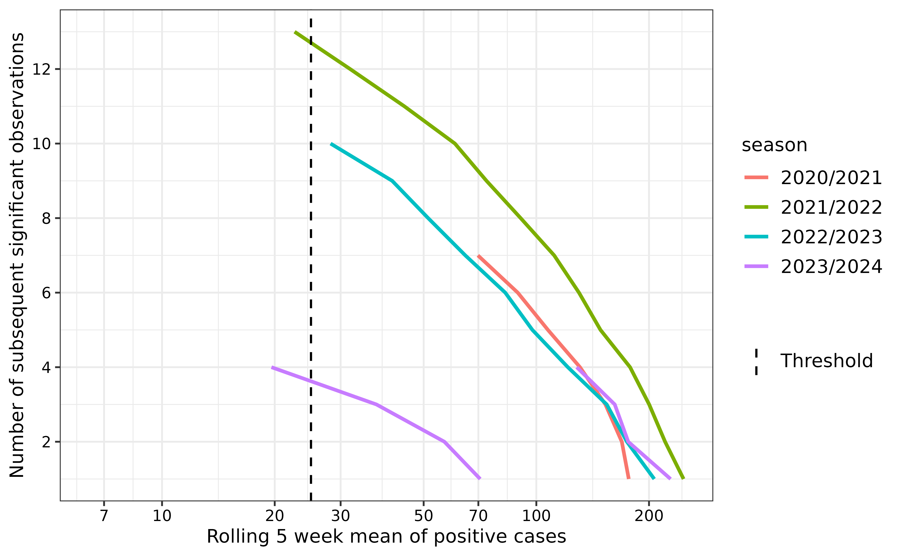

# Automated Detection of Seasonal Epidemic Onset and Burden Levels in R

``` r
library(aedseo)
```

## Introduction

The `aedseo` package performs automated and early detection of seasonal
epidemic onsets and estimates the breakpoints for burden levels from
time series data stratified by season. The seasonal onset
([`seasonal_onset()`](https://ssi-dk.github.io/aedseo/reference/seasonal_onset.md))
estimates growth rates for consecutive time intervals of cases and
calculates the rolling average of observations (cases or incidence) in
the selected time intervals. The burden levels
([`seasonal_burden_levels()`](https://ssi-dk.github.io/aedseo/reference/seasonal_burden_levels.md))
use the previous seasons to estimate the burden levels of the current
season. The algorithm allows for surveillance of pathogens, by alarming
when the observations have significant growth in the selected time
interval and based on the disease-specific threshold, while also
evaluating the burden of current observations based on previous seasons.

### Seasonal data

To apply the `aedseo` algorithm, data needs to be transformed into a
`tsd` object. If you have your own data, the
[`to_time_series()`](https://ssi-dk.github.io/aedseo/reference/to_time_series.md)
function can be used with the arguments: `cases`, `incidence`,
`population`, `incidence_denominator`, `time` and `time_interval`. As
default both
[`seasonal_onset()`](https://ssi-dk.github.io/aedseo/reference/seasonal_onset.md)
and
[`seasonal_burden_levels()`](https://ssi-dk.github.io/aedseo/reference/seasonal_burden_levels.md)
use `cases`, but if `incidence` is in the `tsd` object the output will
be in `incidence` instead. If `population` is additionally given as
arguments the function will calculate the `incidence` per 100.000
(default for `incidence_denominator` which can be changed in input). In
the following section, the application of the algorithm is shown with
simulated cases created with the
[`generate_seasonal_data()`](https://ssi-dk.github.io/aedseo/reference/generate_seasonal_data.md)function.
More information about the function can be found in the
[`vignette("generate_seasonal_wave")`](https://ssi-dk.github.io/aedseo/articles/generate_seasonal_wave.md).

In the following figure simulated data (solid circles) are visualised as
cases over time (weeks). The solid line connects these circles,
representing the underlying mean trend over five years of weekly data.

``` r
plot(tsd_data)
```


### Determining season

Respiratory viruses can circulate in different seasons based on the
location. In the nordic hemisphere they mostly circulate in the fall and
winter seasons, hence surveillance is intensified from week 40 to week
20 in the following year. To include all data, the season in the example
is set from week 21 to week 20 in the following year. In this example
burden levels and seasonal onset will be estimated for season
*2024/2025*.

### Determining the disease specific threshold

When cases are low there is a risk that randomness will result in
significant growth estimates in isolated periods. To increase the
robustness of the method a disease-specific threshold is introduced. It
should be set such that subsequent estimates of growth are likely to be
significant as well. The disease-specific threshold can be determined by
examining continuous periods with sustained significant growth, and
determine at what number of cases these events occur.

In this example the disease-specific threshold is determined based on
consecutive significant weeks from all available previous seasons.
Significant weeks are defined as those with a case count that has a
significant positive growth rate.

To capture short-term changes and fluctuations in the cases, a rolling
window of size $k = 5$ is used to create subsets of the cases for model
fitting, and the `quasipoisson` family is used to account for
overdispersion.

The
[`estimate_disease_threshold()`](https://ssi-dk.github.io/aedseo/reference/estimate_disease_threshold.md)
function can be used to automatically estimate the disease-specific
threshold. As default it uses;

- Three time steps that have to be significant for the sequence to be
  considered in the estimation.
- A max gap time of one time step that is allowed to be non-significant
  between two significant sequences.
- Three historical seasons.
- The longest sequence closest to the peak.
- A decay factor of 0.8 such that the influence of older seasons
  diminishes exponentially.

The disease-specific threshold can also be estimated analytically. In
this example it is done with the four available previous seasons. The
[`seasonal_onset()`](https://ssi-dk.github.io/aedseo/reference/seasonal_onset.md)
function can be used for this purpose, without providing the
disease-specific threshold. Then the
[`consecutive_growth_warnings()`](https://ssi-dk.github.io/aedseo/reference/consecutive_growth_warnings.md)
function can be used to create groups with subsequent significant weeks.
The data can then be analysed, else you can use plot/autoplot to
visualise the sequences of significant weeks for each season.

The `average_observation_window` variable represents the average of
cases over a five-week window, which is used to define the
disease-specific threshold.

``` r
tsd_onset <- seasonal_onset(
  tsd = tsd_data,
  k = 5,
  family = "quasipoisson",
  na_fraction_allowed = 0.4,
  season_start = 21, # Season starts in week 21
  season_end = 20, # Season ends in week 20 the following year
  only_current_season = FALSE
)

consecutive_gr_warn <- consecutive_growth_warnings(
  onset_output = tsd_onset
)

autoplot(
  consecutive_gr_warn,
  k = 5,
  skip_current_season = TRUE
) +
  ggplot2::geom_vline(
    ggplot2::aes(xintercept = 25, linetype = "Threshold"),
    color = "black", linewidth = 0.6
  ) +
  ggplot2::scale_linetype_manual(
    name   = "",
    values = c("Threshold" = "dashed")
  )
```



From the plot above, we observe the length of periods (weeks) with
subsequent significant growth rates (y-axis). The season with the
longest consecutive period of growth is *2021/2022*, lasting 14 weeks.
However, since we are determining a threshold specifically for the
*2024/2025* season, it’s important to prioritize the most recent
seasons. The *2023/2024* season shows two periods of significant growth,
with the first being the longest and coinciding closely in timing with
the consecutive growth period observed in *2022/2023*. We select a
disease-specific threshold of 25 to ensure early detection of the
seasonal onset while minimizing false positives.

In other words, a season onset is declared when the average case count
over five weeks surpasses 25 and is accompanied by a significantly
positive growth rate.

Inspect the exact conditions around each detected season start

``` r
consecutive_gr_warn |>
  dplyr::filter(!is.na(significant_counter)) |>
  dplyr::filter(season != max(consecutive_gr_warn$season)) |>
  dplyr::group_by(season) |>
  dplyr::filter(significant_counter == max(significant_counter)) |>
  dplyr::mutate(disease_threshold = average_observations_window,
                week = ISOweek::ISOweek(reference_time)) |>
  dplyr::select(season, week, disease_threshold)
#> # A tibble: 5 × 3
#> # Groups:   season [4]
#>   season    week     disease_threshold
#>   <chr>     <chr>                <dbl>
#> 1 2020/2021 2020-W46              69.8
#> 2 2021/2022 2021-W41              22.6
#> 3 2022/2023 2022-W42              28.2
#> 4 2023/2024 2023-W41              19.6
#> 5 2023/2024 2023-W48             128.
```

By inspecting the output from the above code, the disease-specific
threshold is established at `25` cases.

## Applying the main algorithm

The primary function of the `aedseo` package is the
[`combined_seasonal_output()`](https://ssi-dk.github.io/aedseo/reference/combined_seasonal_output.md)
which integrates the
[`seasonal_onset()`](https://ssi-dk.github.io/aedseo/reference/seasonal_onset.md)
and
[`seasonal_burden_levels()`](https://ssi-dk.github.io/aedseo/reference/seasonal_burden_levels.md)
functions to deliver a comprehensive seasonal analysis. Detailed
information about each function and their respective arguments can be
found in the
[`vignette("seasonal_onset")`](https://ssi-dk.github.io/aedseo/articles/seasonal_onset.md)
and
[`vignette("burden_levels")`](https://ssi-dk.github.io/aedseo/articles/burden_levels.md).

``` r
seasonal_output <- combined_seasonal_output(
  tsd = tsd_data,
  disease_threshold = 25,
  method = "intensity_levels",
  family = "quasipoisson"
)
```

The default function estimates onset and burden levels for the current
season. If it is desired to see calculations for all previous seasons,
the `only_current_season` argument should be set to `FALSE`. *Note:*
Burden levels can not be estimated for the first season and needs at
least two seasons of data as the estimations are based on data from
previous seasons.\\

The `aedseo` package implements S3 methods including the
[`plot()`](https://ssi-dk.github.io/aedseo/reference/plot.md),
[`predict()`](https://rdrr.io/r/stats/predict.html) and
[`summary()`](https://rdrr.io/r/base/summary.html) functions
specifically designed for objects of the `aedseo` package.
[`predict()`](https://rdrr.io/r/stats/predict.html) is only relevant for
`tsd_onset` objects. An example of using the
[`summary()`](https://rdrr.io/r/base/summary.html) S3 method with
`tsd_onset` and `tsd_burden_level` objects is shown here.

Seasonal onset output can be extracted by:

``` r
summary(seasonal_output$onset_output)
#> Summary of tsd_onset object with disease_threshold
#> 
#>       Model output:
#>         Reference time point (first seasonal onset alarm in season): 2024-11-03
#>         Observations at reference time point: 131
#>         Average observations (in k window) at reference time point: 65.8
#>         Growth rate estimate at reference time point:
#>           Estimate   Lower (2.5%)   Upper (97.5%)
#>             0.312     0.517          0.117
#>         Total number of growth warnings in the series: 11
#>         Latest growth warning: 2024-12-22
#>         Latest average observations warning: 2025-01-26
#>         Latest seasonal onset alarm: 2024-12-22
#> 
#>       The season for reference time point:
#>         2024/2025
#> 
#>       Model settings:
#>         Called using distributional family: quasipoisson
#>         Window size: 5
#>         The time interval for the observations: weeks
#>         Disease specific threshold: 25
#>         Incidence denominator: NA
```

Seasonal burden output can be extracted by:

``` r
summary(seasonal_output$burden_output)
#> Summary of tsd_burden_levels object
#> 
#>     Breakpoint estimates:
#>       very low : 25.000000
#>       low: 61.188227
#>       medium: 149.759965
#>       high: 366.541871
#> 
#>     The season for the burden levels:
#>       2024/2025
#> 
#>     Model settings:
#>       Disease specific threshold: 25
#>       Incidence denominator: NA
#>       Called using distributional family: lnorm
```

### Plot the comprehensive seasonal analysis

The [`plot()`](https://ssi-dk.github.io/aedseo/reference/plot.md) S3
method for `tsd_combined_seasonal_output` objects allows you to get a
complete visualisation of the
[`combined_seasonal_output()`](https://ssi-dk.github.io/aedseo/reference/combined_seasonal_output.md)
analysis of the current season.

``` r
# Adjust y_lower_bound dynamically to remove noisy small values
disease_threshold <- 25
y_lower_bound <- ifelse(disease_threshold < 10, 1, 5)

plot(
  x = seasonal_output,
  y_lower_bound = y_lower_bound,
  time_interval = "3 weeks"
)
```


Using the `intensity_levels` method to define burden levels, the
seasonal onset is likely to fall within the `low` or `medium` category.
This is because the `very low` breakpoint is the disease-specific
threshold, and season onset is only identified if the five-week average
of the observations exceed this threshold along with a significant
positive growth rate.

### Investigate historical estimates

The
[`historical_summary()`](https://ssi-dk.github.io/aedseo/reference/historical_summary.md)
function for `tsd_onset` objects provides historical estimates from all
previous seasons. By utilising this function, it is easy to assess
whether current estimates align with previously observed patterns for a
specific pathogen, or if significant changes have occurred. Such changes
might result from altered testing practices, pathogen mutations, or
other factors.

If the analysis indicates notable deviations from past patterns, it is
advisable to revisit the method used to define the disease-specific
threshold, as it might need some adjustment.

``` r
# Get `tsd_onset` object
tsd_onset <- seasonal_onset(
  tsd = tsd_data,
  disease_threshold = 25,
  family = "quasipoisson",
  season_start = 21,
  season_end = 20,
  only_current_season = FALSE
)

historical_summary(tsd_onset)
#> # A tibble: 5 × 10
#>   season    onset_time peak_time  peak_intensity lower_growth_rate_onset
#>   <chr>     <date>     <date>              <dbl>                   <dbl>
#> 1 2020/2021 2020-11-15 2021-01-10            275                 0.00681
#> 2 2021/2022 2021-10-24 2022-01-09            292                 0.155  
#> 3 2022/2023 2022-10-23 2022-12-25            287                 0.412  
#> 4 2023/2024 2023-10-22 2024-01-07            377                 0.501  
#> 5 2024/2025 2024-11-03 2025-01-12            331                 0.117  
#> # ℹ 5 more variables: growth_rate_onset <dbl>, upper_growth_rate_onset <dbl>,
#> #   onset_week <dbl>, peak_week <dbl>, weeks_to_peak <dbl>
```

## Example with incidence

In the `tsd` object from previous example we add that the population is
1.000.000 and increases with 1000 each week. The default incidence
denominator (100.000) is used.

``` r
tsd_incidence <- to_time_series(
  cases = tsd_data$cases,
  time = tsd_data$time,
  population = seq(from = 1000000, by = 1000, length.out = length(tsd_data$cases))
)
```

Determine the disease-specific threshold:
 Run the main
algorithm:

``` r
seasonal_output_incidence <- combined_seasonal_output(
  tsd = tsd_incidence,
  disease_threshold = 2,
  method = "intensity_levels",
  family = "quasipoisson"
)
```

*NOTE:* Since the population changes during the time series this is
adjusted for in the growth rate estimations in
[`seasonal_onset()`](https://ssi-dk.github.io/aedseo/reference/seasonal_onset.md)
by adding it as offset to the model.

Plot results for the current season with cases pr. 100.000 (incidence):

``` r
plot(
  x = seasonal_output_incidence,
  y_lower_bound = 1,
  time_interval = "3 weeks"
)
```


