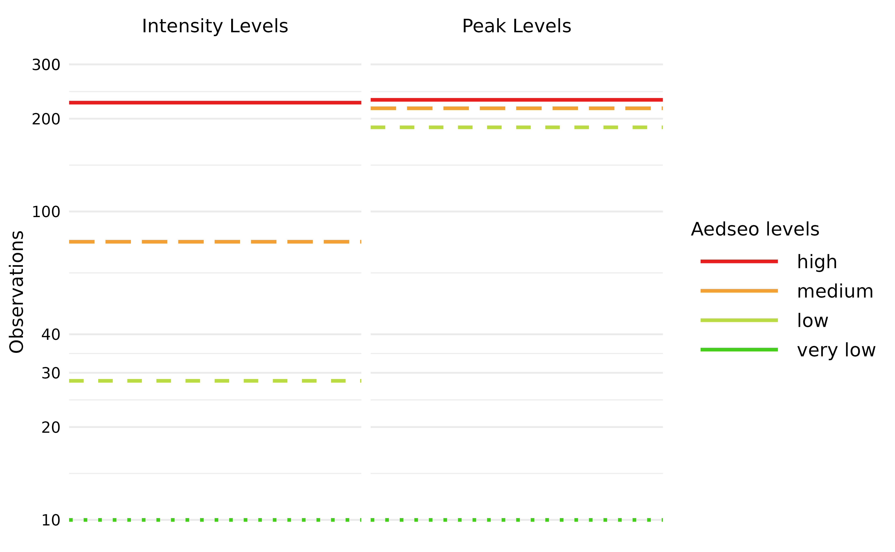
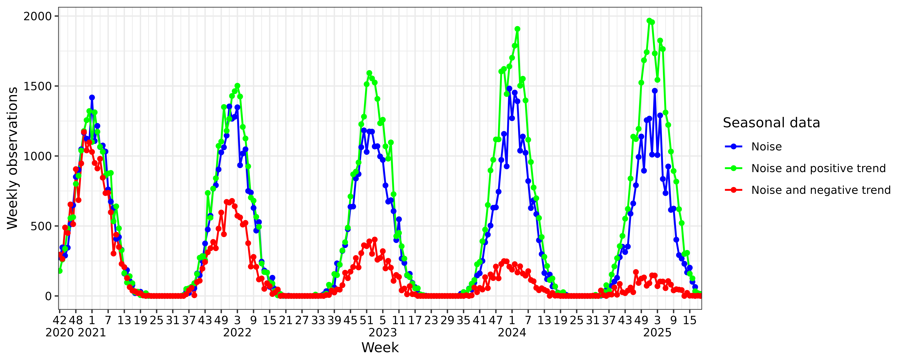
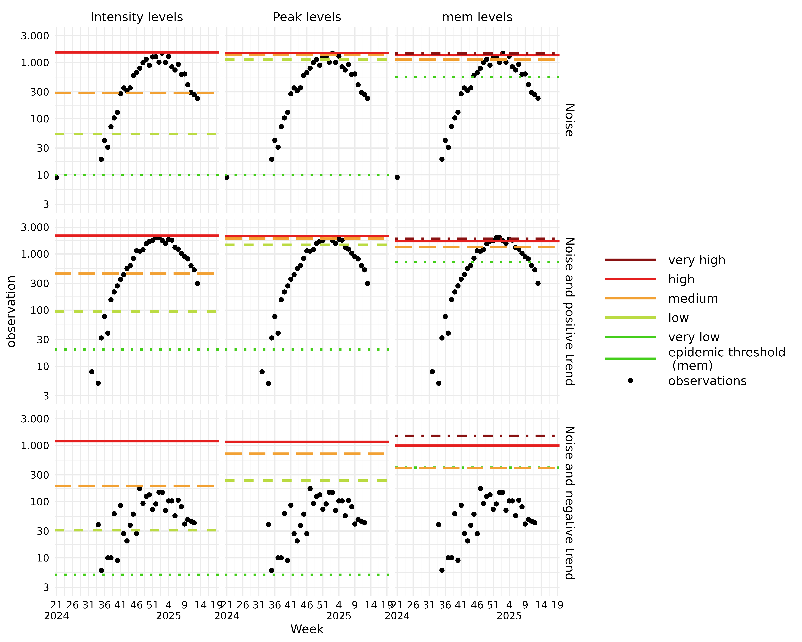

# Seasonal Burden Levels

``` r
library(aedseo)
```

To provide a concise overview of how the
[`seasonal_burden_levels()`](https://ssi-dk.github.io/aedseo/reference/seasonal_burden_levels.md)
algorithm operates, we utilize the same example data presented in the
[`vignette("aedseo")`](https://ssi-dk.github.io/aedseo/articles/aedseo.md).
The plot below illustrates the two methods available for estimating
burden levels in the
[`combined_seasonal_output()`](https://ssi-dk.github.io/aedseo/reference/combined_seasonal_output.md)
function:

- **`intensity_levels`**: Intended for within-season classification of
  observations.
- **`peak_levels`**: Intended for comparing the height of peaks between
  seasons.

The disease-specific threshold is the `very low` breakpoint for both
methods. Breakpoints are named as the upper bounds for the burden
levels, and are visualised on following plot.



## Methodology

The methodology used to define the burden levels of seasonal epidemics
is based on observations (cases or incidence) from previous seasons.
Historical data from all available seasons is used to establish the
levels for the current season. This is done by:

- Using either cases or incidence as observations (default is `cases`,
  but if `incidence` is in the `tsd` object it will be used instead).
- Using `n` highest (peak) observations from each season.
- Selecting only observations if they surpass the disease-specific
  threshold.
- Weighting the observations such that recent observations have a
  greater influence than older observations.
- A proper distribution (log-normal, weibull and exponential are
  currently implemented) is fitted to the weighted `n` peak
  observations. The selected distribution with the fitted parameters is
  used to calculate percentiles to be used as breakpoints.
- Burden levels can be defined by two methods:
  - `peak_levels` which models the height of the seasonal peaks. Using
    the log-normal distribution without weights is similar to the
    default in [mem](https://github.com/lozalojo/mem).
  - `intensity_levels` which models the within season levels. The
    highest breakpoint is identical with the `peak_levels` method.
    Intermediate breakpoints are evenly distributed on a logaritmic
    scale, between the `very low` and `high` breakpoints, to give the
    same relative difference between the breakpoints.

The model is implemented in the
[`seasonal_burden_levels()`](https://ssi-dk.github.io/aedseo/reference/seasonal_burden_levels.md)
function of the `aedseo` package. In the following sections we will
describe the arguments for the function and how the model is build.

#### Peak observations

The `n_peak` argument defines the number of highest observations to be
included from each season. The default of `n_peak` is `6` -
corresponding with the `mem` defaults of using 30 observations across
the latest five seasons.

#### Weighting

The `decay_factor` argument is implemented to give more weight to recent
seasons, as they are often more indicative of current and future trends.
As time progresses, the relevance of older seasons may decrease due to
changes in factors like testing recommendations, population immunity,
virus mutations, or intervention strategies. Weighting older seasons
less reflects this reduced relevance. From time-series analysis,
$\frac{1}{1 - \text{decay\_factor}}$ is often used as an approximate
“effective memory”. Hence, with the default `decay_factor` = 0.8 the
effective memory is five seasons. (See mentioned by [Hyndman &
Athanasopoulos](https://otexts.com/fpp3/ses.html#ses) for an
introduction to simple exponential smoothing) The default `decay_factor`
allows the model to be responsive to recent changes without being overly
sensitive to short-term fluctuations. The optimal `decay_factor` can
vary depending on the variability and trends within the data. For
datasets where seasonal patterns are highly stable, a higher
`decay_factor` (i.e. longer memory) may be appropriate. Conversely, if
the data exhibit dramatic shifts from one season to the next, a lower
`decay_factor` may improve predictions.

#### Distribution and optimisation

The `family` argument is used to select which distribution the `n_peak`
observations should be fitted to, users can choose between `lnorm`,
`weibull` and `exp` distributions. The log-normal distribution
theoretically aligns well with the nature of epidemic data, which often
exhibits multiplicative growth patterns. In our optimisation process, we
evaluated the distributions to determine their performance in fitting
Danish non-sentinel cases and hospitalisation data for RSV, SARS-CoV-2
and Influenza (A and B). All three distributions had comparable weighted
likelihood values during optimisation, hence we did not see any
statistical significant difference in their performance.

The model uses the
[`fit_percentiles()`](https://ssi-dk.github.io/aedseo/reference/fit_percentiles.md)
function which employs the
[`stats::optim`](https://rdrr.io/r/stats/optim.html) for estimating the
parameters that maximizes the weighted likelihood. The `optim_method`
argument can be passed to
[`seasonal_burden_levels()`](https://ssi-dk.github.io/aedseo/reference/seasonal_burden_levels.md),
default is `Nelder-Mead` but other methods can be selected, see
[`?fit_percentiles`](https://ssi-dk.github.io/aedseo/reference/fit_percentiles.md).

#### Burden levels

The `method` argument is used to select one of the two methods
`intensity_levels`(default) and `peak_levels`. Both methods return
percentile(s) from the fitted distribution which are used to define the
breakpoins for the burden levels. Breakpoints are named `very low`,
`low`, `medium` and `high` and define the upper bound of the
corresponding burden level.

- `intensity_levels` takes one percentile as argument, representing the
  highest breakpoint. The default is set at a 95% percentile. The
  disease-specific threshold determines the `very low` breakpoint. The
  `low` and `medium` breakpoints are calculated to give identical
  relative increases between the `very low` and `high` breakpoints.

- `peak_levels` takes three percentiles as argument, representing the
  `low`, `medium` and `high` breakpoints. The default percentiles are
  40%, 90%, and 97.5% to align with the parameters used in `mem`. The
  disease-specific threshold defines the `very low` breakpoint.

## Applying the `seasonal_burden_levels()` algorithm

The same data is created with following combinations:

- noise
- noise and positive trend
- noise and negative trend

These combinations are selected as it is realistic for real world data
to have noise, and differentiation between trend can occur declining or
inclining between seasons. Breakpoints for season *2024/2025* are
calculated based on the three previous seasons.

To apply the
[`seasonal_burden_levels()`](https://ssi-dk.github.io/aedseo/reference/seasonal_burden_levels.md)
algorithm, data needs to be transformed into a `tsd` object. The
disease-specific threshold is determined for all data combinations with
use of the method described in
[`vignette("aedseo")`](https://ssi-dk.github.io/aedseo/articles/aedseo.md).
The disease-specific threshold should be revised before a new season
starts, especially if the data has a trend.


### Use the intensity_levels method

The
[`seasonal_burden_levels()`](https://ssi-dk.github.io/aedseo/reference/seasonal_burden_levels.md)
function provides a `tsd_burden_level` object, which can be used in the
[`summary()`](https://rdrr.io/r/base/summary.html) S3 method. This
provides a concise summary of your comprehensive seasonal burden level
analysis, including breakpoints for the current season.

``` r
intensity_levels_n <- seasonal_burden_levels(
  tsd = tsd_data_noise,
  disease_threshold = 10,
  method = "intensity_levels",
  conf_levels = 0.975
)
summary(intensity_levels_n)
#> Summary of tsd_burden_levels object
#> 
#>     Breakpoint estimates:
#>       very low : 10.000000
#>       low: 53.267535
#>       medium: 283.743033
#>       high: 1511.429206
#> 
#>     The season for the burden levels:
#>       2025/2026
#> 
#>     Model settings:
#>       Disease specific threshold: 10
#>       Incidence denominator: NA
#>       Called using distributional family: lnorm
```

### Use the peak_levels method

`mem` uses the `n` highest observations from each previous epidemic
period to fit the parameters of the distribution, where
`n = 30/seasons`. The data has four previous seasons, to align with mem,
we use `n_peak = 8`

``` r
peak_levels_n <- seasonal_burden_levels(
  tsd = tsd_data_noise,
  disease_threshold = 10,
  method = "peak_levels",
  conf_levels = c(0.4, 0.9, 0.975),
  n_peak = 8
)
summary(peak_levels_n)
#> Summary of tsd_burden_levels object
#> 
#>     Breakpoint estimates:
#>       very low : 10.000000
#>       low: 1133.397742
#>       medium: 1366.530366
#>       high: 1484.312479
#> 
#>     The season for the burden levels:
#>       2025/2026
#> 
#>     Model settings:
#>       Disease specific threshold: 10
#>       Incidence denominator: NA
#>       Called using distributional family: lnorm
```

## Compare intensity_levels, peak_levels and mem algorithms

[mem](https://github.com/lozalojo/mem) is run with default arguments.

``` r
# Remove current season such as previous seasons predict for newest season
previous_seasons <- tsd_data_all |>
  dplyr::mutate(season = epi_calendar(time)) |>
  dplyr::filter(season != "2024/2025") |>
  dplyr::select(-season)

# Run mem algorithm
mem_thresholds <- previous_seasons |>
  dplyr::group_by(Data) |>
  dplyr::group_modify(~ {
    mem_data <- .x |>
      dplyr::mutate(season = aedseo::epi_calendar(time),
                    week = lubridate::isoweek(time)) |>
      dplyr::select(-time) |>
      tidyr::pivot_wider(names_from = season, values_from = cases) |>
      dplyr::select(-week)
    # Run mem
    mem_result <- mem::memmodel(mem_data)
    # Extract thresholds
    mem_thresholds <- tibble::tibble(
      `epidemic threshold \n (mem)` = mem_result$epidemic.thresholds[1],
      `medium` = mem_result$intensity.thresholds[1],
      `high` = mem_result$intensity.thresholds[2],
      `very high` = mem_result$intensity.thresholds[3]
    )
  })
```

### aedseo and mem levels



In the plots:

- Observations below 3 are filtered out to improve visualization.
- y scale is log transformed.

Upon examining all methods and data combinations, it becomes clear that
the `intensity_levels` approach establishes levels covering the entire
set of observations from previous seasons. In contrast, the
`peak_levels` and `mem` methods define levels solely based on the
highest observations within each season, and are thus only relevant for
comparing the height of peaks between seasons.

The highest observations for the *2024/2025* season for each data set
are:

| Data                     | Observation |
|--------------------------|-------------|
| Noise                    | 1466        |
| Noise and positive trend | 1967        |
| Noise and negative trend | 171         |

In relation to these highest observations and upon further examination,
we observe the following:

Plots with Noise and Noise with Positive Trend:

- Both `peak_levels` and `mem` estimate very high breakpoints. This
  occurs because observations remain consistently elevated across all
  three seasons, causing these methods to overlook the remaining
  observations.

Data with Noise and Positive Trend:

- All three methods exhibit higher breakpoints, indicating that they
  successfully capture the exponentially increasing trend between
  seasons.

Data with Noise and Negative Trend:

- As observations exponentially decrease between seasons (with the
  highest observation this season being 171), we expect the breakpoints
  to be the lowest of these examples. This expectation is met across all
  three methods. However, the weighting of seasons in `intensity_levels`
  and `peak_levels` leads to older seasons having less impact on the
  breakpoints, as we progress forward in time. On the other hand, `mem`
  includes all high observations from the previous 10 seasons without
  diminishing the importance of older seasons, which results in
  sustained very high breakpoints.

- Notably, in the `mem` method, the epidemic threshold is positioned
  slightly above the `medium` burden level. This means that the epidemic
  period begins only when observations reach the height of the seasonal
  peaks observed in previous seasons.

In conclusion, the `peak_levels` and `mem` methods allows us to compare
the height of peaks between seasons, whereas the `intensity_levels`
method supports continuous monitoring of observations in the current
season.
