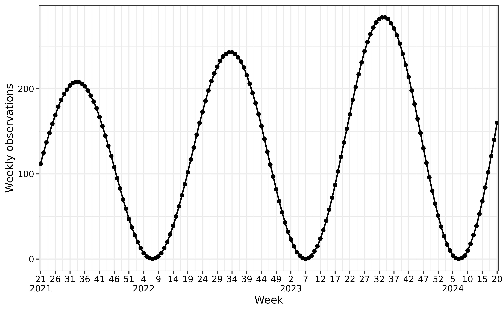

# Simulate Seasonal Epidemic Waves

``` r
library(aedseo)
```

## Simulation

To demonstrate seasonal variation in a time series while accounting for
trends and variability, we use the `generate_seasonal_wave()` function.
This function generates a sinusoidal wave to represent periodic
fluctuations, such as dayly, weekly or monthly cycles, while also
incorporating optional exponential trend and random noise. This makes it
suitable for modeling more realistic phenomena like infection rates. The
wave is defined by the following equation:
$$\text{E[SeasonalWave}(t)\text{]} = \text{mean} + \text{amplitude} \cdot \left( \frac{\left( \sin\left( \frac{2\pi t}{\text{period}} + \text{phase} \right) + 1 \right)^{\text{relative\_epidemic\_concentration}}}{2^{\text{relative\_epidemic\_concentration} - 1}} - 1 \right) \cdot e^{\log{(\text{trend\_rate})} \cdot t}$$

Where:

- $t$: The time variable (e.g., weeks or months, represented on the
  x-axis).
- $\text{amplitude}$: Controls the height of the oscillations; the
  output varies between **$\text{mean} \pm \text{amplitude}$**.
- $\text{mean}$: The baseline value around which the seasonal wave
  oscillates. Must be greater than or equal to the amplitude.
- $\text{period}$: Defines the cycle length (e.g., 52 weeks for yearly
  seasonality) (is calculated based on `time_interval`).
- $\text{phase}$: Adjusts the horizontal position of the wave on the
  x-axis.
- $\text{trend\_rate}$: Controls the exponential growth or decay of the
  trend over time.
- $\text{relative\_epidemic\_concentration}$: Transforms the reference
  sinusoidal season. A value of 1 gives the pure sinusoidal curve, and
  greater values concentrate the epidemic around the peak.

Furthermore, noise can be controlled by the `noise_overdispersion`
parameter.

- 0: Deterministic, no noise.
- 1: Poisson-distributed noise.
- \>1: Negative binomial-distributed noise (higher values mean greater
  overdispersion).

The first step is to create and transform simulated data into a `tsd`
object using the
[`generate_seasonal_data()`](https://ssi-dk.github.io/aedseo/reference/generate_seasonal_data.md)
function.

- `time_interval` is a character vector specifying the time interval,
  choose between “day,” “week,” or “month.”

``` r
seasonal_wave_sim_weekly <- generate_seasonal_data(
  years = 3,
  start_date = as.Date("2021-05-26"),
  amplitude = 100,
  mean = 100,
  trend_rate = 1.003,
  time_interval = "weeks"
)
```

## Plot seasonal waves

The `aedseo` package has an implemented a
[`plot()`](https://ssi-dk.github.io/aedseo/reference/plot.md) S3 method
to plot the `tsd` object. The `time_interval` argument can be used to
visualise the x-axis as desired, either with days, weeks or months.

The following figures shows the simulated data (solid circles) as
individual observations. The solid line connects these points,
representing the underlying mean trend over three years of weekly data.

### Example of positive trend (weekly observations)

The x-axis shows the weeks and years, while the y-axis represents the
simulated observations. In this simulation there is a positive
`trend_rate`, which can be seen as the observations increase
exponentially across seasons.

``` r
plot(seasonal_wave_sim_weekly, time_interval = "5 weeks")
```



### Example of negative trend (monthly observations)

The x-axis shows the months and years, while the y-axis represents the
simulated observations. In this simulation there is a negative
`trend_rate`, which can be seen as the observations decrease
exponentially across seasons.

``` r
seasonal_wave_sim_monthly <- generate_seasonal_data(
  years = 4,
  start_date = as.Date("2021-05-26"),
  amplitude = 50,
  mean = 50,
  trend_rate = 0.99,
  time_interval = "months"
)
plot(
  seasonal_wave_sim_monthly,
  time_interval = "3 months",
  y_label = "Monthly observations"
)
```


### Example of no trend (daily observations)

The x-axis shows the days, months, years, while the y-axis represents
the simulated observations. In this simulation there is no trend.

``` r
seasonal_wave_sim_daily <- generate_seasonal_data(
  years = 3,
  start_date = as.Date("2021-05-26"),
  amplitude = 50,
  mean = 50,
  time_interval = "days"
)
plot(
  seasonal_wave_sim_daily,
  time_interval = "50 days",
  y_label = "Daily observations"
)
```


### Example of phase shift (daily observations)

A phase shift in a sinusoidal pattern effectively shifts where the wave
starts along the x-axis instead of peaking (or hitting zero) at the same
times as a wave with `phase = 0` (like in previous plot), it is shifted
in time. in this example where `phase = 1` rather than `0`, we see that
the rise and fall of the sine wave happens later compared to a wave with
no phase shift.

``` r
seasonal_wave_sim_daily_phase_shift <- generate_seasonal_data(
  years = 3,
  start_date = as.Date("2021-05-26"),
  amplitude = 50,
  mean = 50,
  phase = 1,
  time_interval = "days"
)
plot(
  seasonal_wave_sim_daily_phase_shift,
  time_interval = "50 days",
  y_label = "Daily observations"
)
```


### Examples of different noise scenarios

The following examples illustrate how varying `noise_overdispersion`
affects the realism and variability of simulated data, enabling the
modeling of realistic epidemic scenarios. The noise is the jumps between
observations, instead of smoothly transitioning between observations.

#### Deterministic (no noise)

``` r
sim_no_noise <- generate_seasonal_data(
  years = 3,
  start_date = as.Date("2021-05-26"),
  amplitude = 100,
  mean = 100,
  noise_overdispersion = 0,
  time_interval = "weeks"
)
plot(
  sim_no_noise,
  time_interval = "5 weeks"
)
```


#### Poisson-distributed noise

``` r
sim_poisson_noise <- generate_seasonal_data(
  years = 3,
  start_date = as.Date("2021-05-26"),
  amplitude = 100,
  mean = 100,
  noise_overdispersion = 1,
  time_interval = "weeks"
)
plot(
  sim_poisson_noise,
  time_interval = "5 weeks"
)
```


#### Negative binomial-distributed noise (high overdispersion)

``` r
sim_nb_noise <- generate_seasonal_data(
  years = 3,
  start_date = as.Date("2021-05-26"),
  amplitude = 100,
  mean = 100,
  noise_overdispersion = 5,
  time_interval = "weeks"
)
plot(
  sim_nb_noise,
  time_interval = "5 weeks"
)
```


### Examples of different epidemic concentrations

#### Pure sinusoidal season

``` r
sim_sinus <- generate_seasonal_data(
  years = 2,
  start_date = as.Date("2021-05-26"),
  amplitude = 100,
  mean = 100,
  relative_epidemic_concentration = 1,
  time_interval = "weeks"
)
plot(
  sim_sinus,
  time_interval = "5 weeks"
)
```


#### Epidemic concentrated season

The following examples illustrate how varying
`relative_epidemic_concentration` affects the time period for when we
observe observations. When the value is increased, the observations are
concentrated around the peak. This enables the model to improve it’s
abbility to model realistic epidemic scenarios, as we commonly see
several weeks with no or low infection rates and a shorter epidemic
period.

``` r
sim_conc <- generate_seasonal_data(
  years = 2,
  start_date = as.Date("2021-05-26"),
  amplitude = 100,
  mean = 100,
  relative_epidemic_concentration = 4,
  time_interval = "weeks"
)
plot(
  sim_conc,
  time_interval = "5 weeks"
)
```


