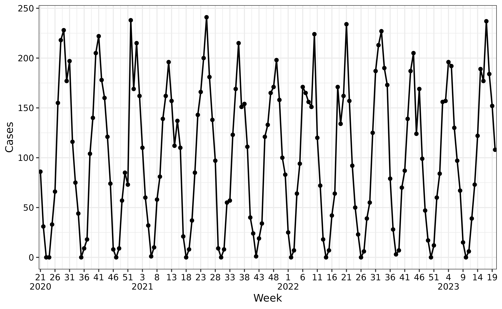
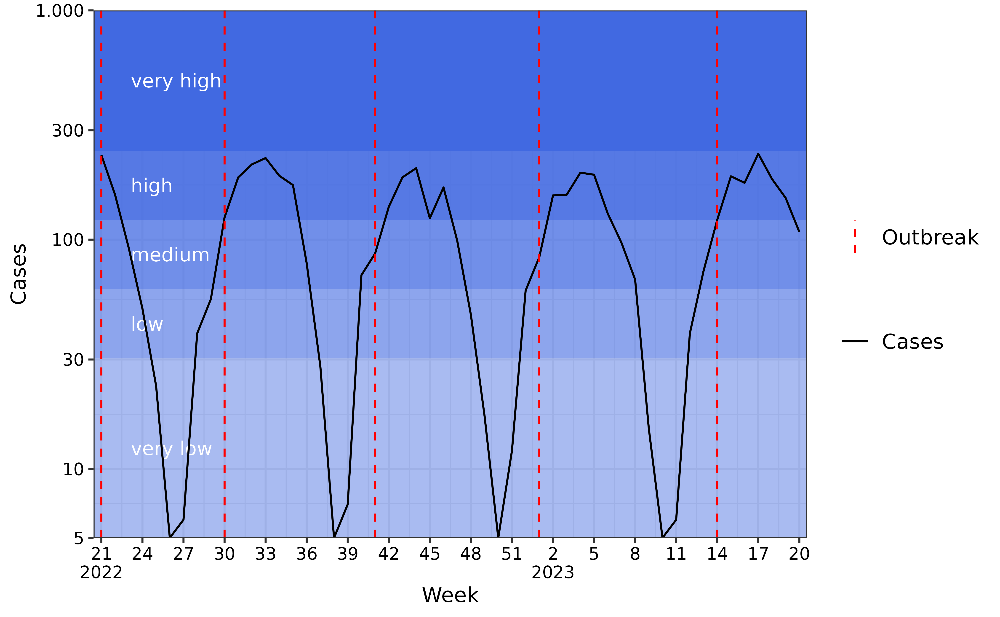

# Multiple waves

``` r
library(aedseo)
```

## Methodology

This method uses the seasonal onset and burden level methodology to
estimate multiple waves for diseases that do not follow a one peak per
season pattern. The burden levels are used to define when the first wave
has ended by dropping below the desired intensity breakpoint, whereafter
a new wave can start. The seasonal onset method is used to determine
each wave onset - in the same way as for the single seasonal onset.

The
[`combined_seasonal_output()`](https://ssi-dk.github.io/aedseo/reference/combined_seasonal_output.md)
function implements this functionality by defining the following
variables:

- $\text{multiple\_waves}$: A logical. Should the output contain
  multiple waves?
- $\text{burden\_level\_decrease}$: A character string specifying the
  burden breakpoint the observations should decrease below before a new
  increase in observations can call a new wave onset if seasonal onset
  criteria are met. Choose between; “very low”, “low”, “medium”, or
  “high”.
- $\text{steps\_with\_decrease}$: An integer specifying how many time
  steps (days, weeks, months) the decrease should be observed under the
  `burden_level_decrease` before starting the search for a new wave
  onset.

## Applying the multiple waves algorithm

As an example we first generate cases in a `tsd` object, with the
[`generate_seasonal_data()`](https://ssi-dk.github.io/aedseo/reference/generate_seasonal_data.md)
function. Then we rescale time from monthly to weekly observations to
get multiple waves.

``` r
set.seed(222)
tsd_data_monthly <- generate_seasonal_data(
  years = 14,
  phase = 3,
  start_date = as.Date("2020-05-18"),
  noise_overdispersion = 5,
  time_interval = "months"
)

tsd_data <- to_time_series(
  cases = tsd_data_monthly$cases,
  time = seq.Date(
    from = as.Date("2020-05-18"),
    by = "week",
    length.out = length(tsd_data_monthly$cases)
  )
) |>
  dplyr::filter(time < as.Date("2023-05-22"))
plot(tsd_data)
```



### Estimate disease-specific threshold

Then we estimate the disease-specific threshold.

``` r
disease_threshold <- estimate_disease_threshold(tsd_data)
```

### Estimate multiple waves

Multiple waves are estimated such that after a wave onset, observations
have to decrease below the `low` intensity level for two time steps to
end the wave. A new wave can then start if observations fulfill the
seasonal onset criteria.

``` r
multiple_waves <- combined_seasonal_output(
  tsd_data,
  disease_threshold = disease_threshold$disease_threshold,
  multiple_waves = TRUE,
  burden_level_decrease = "low",
  steps_with_decrease = 2
)
```

### Plot the comprehensive seasonal analysis with multiple waves

 From the
plot we can observe that season 2023/2024 has five waves.
