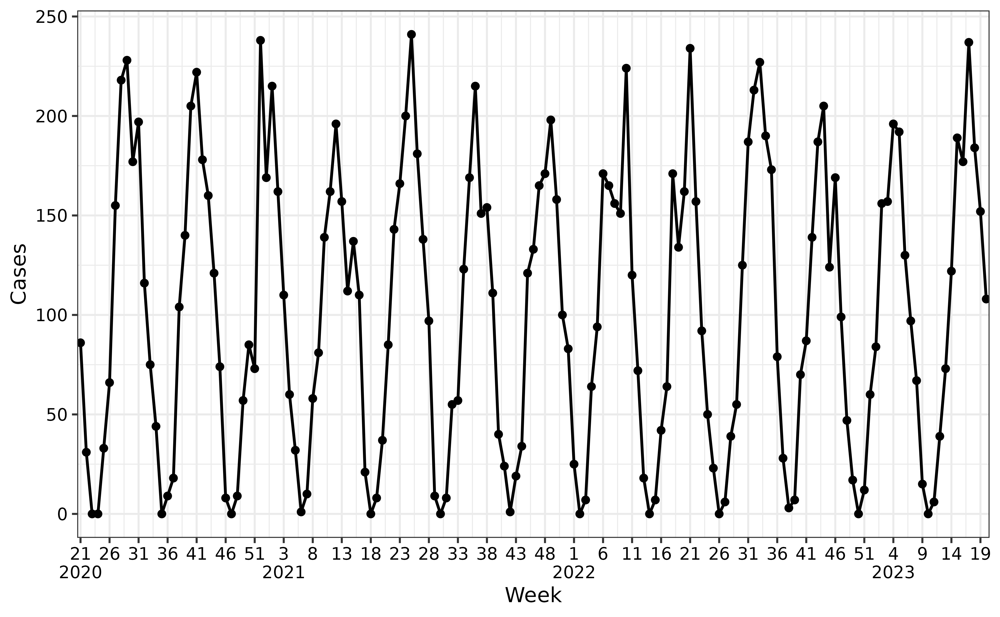
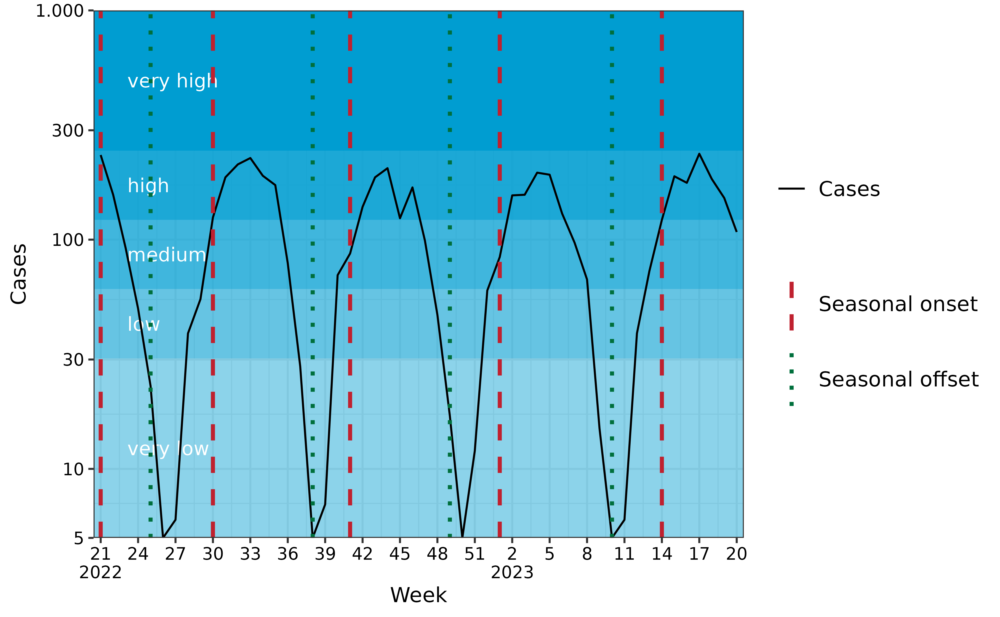

# Multiple waves

``` r
library(aedseo)
```

## Methodology

Some diseases may exhibit multiple epidemic waves within a season rather
than a single peak. This method extends the seasonal onset and burden
level framework to identify multiple waves.

Burden levels are used to determine when a wave has ended: after a wave
onset, activity must decrease below a chosen burden breakpoint for a
specified number of consecutive time steps. Once a wave has ended, a new
wave may start if the seasonal onset criteria are met again.

The
[`combined_seasonal_output()`](https://ssi-dk.github.io/aedseo/reference/combined_seasonal_output.md)
function implements this functionality via:

- $\text{multiple\_waves}$: Logical. Should multiple waves be estimated
  within each season?
- $\text{burden\_level\_decrease}$: Character. The burden breakpoint
  that observations must fall below before a subsequent increase can be
  interpreted as the start of a new wave (provided onset criteria are
  met). Choose one of `"very low"`, `"low"`, `"medium"`, or `"high"`.
- $\text{steps\_with\_decrease}$: Integer. The number of consecutive
  time steps (days, weeks, months) with decreasing observations while
  below `burden_level_decrease` required to declare a wave end and start
  searching for the next wave onset.

## Applying the multiple waves algorithm

As an example we first generate cases in a `tsd` object, with the
[`generate_seasonal_data()`](https://ssi-dk.github.io/aedseo/reference/generate_seasonal_data.md)
function. Then we rescale time from monthly to weekly observations to
get multiple waves.

``` r
set.seed(222)
tsd_data_monthly <- generate_seasonal_data(
  years = 14,
  phase = 3,
  start_date = as.Date("2020-05-18"),
  noise_overdispersion = 5,
  time_interval = "months"
)

tsd_data <- to_time_series(
  cases = tsd_data_monthly$cases,
  time = seq.Date(
    from = as.Date("2020-05-18"),
    by = "week",
    length.out = length(tsd_data_monthly$cases)
  )
) |>
  dplyr::filter(time < as.Date("2023-05-22"))
plot(tsd_data)
```



### Estimate disease-specific threshold

Then we estimate the disease-specific threshold.

``` r
disease_threshold <- estimate_disease_threshold(tsd_data)
disease_threshold$disease_threshold
#> [1] 30.37079
```

### Estimate multiple waves

Multiple waves are estimated such that after a wave onset, observations
have to decrease below the `low` intensity level for two time steps to
end the wave. A new wave can then start if observations fulfill the
seasonal onset criteria.

``` r
multiple_waves <- combined_seasonal_output(
  tsd_data,
  disease_threshold = disease_threshold$disease_threshold,
  multiple_waves = TRUE,
  burden_level_decrease = "low",
  steps_with_decrease = 2
)
```

### Plot the comprehensive seasonal analysis with multiple waves

 From the
plot we can observe that season 2023/2024 has five starting waves and
four ending waves.
