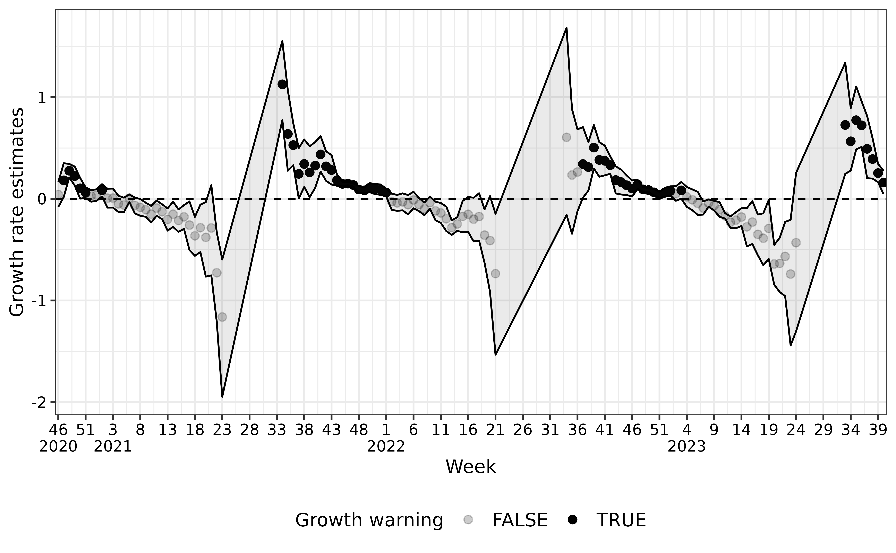

# Seasonal Epidemic Onset

``` r
library(aedseo)
```

## Methodology

The methodology used to detect the seasonal onset of epidemics, can be
divided into two essential criteria:

1.  The local estimate of the exponential growth rate, $r$, is
    significantly greater than zero.
2.  The average observation count over the past $k$ units of time
    exceeds a disease-specific threshold.

Here, $k$ denotes the window size employed to obtain the local estimate
of the exponential growth rate and SoC. When both of these criteria are
met, an alarm is triggered and the onset of the seasonal epidemic is
detected.

The model is implemented in the
[`seasonal_onset()`](https://ssi-dk.github.io/aedseo/reference/seasonal_onset.md)
function of the `aedseo` package. Criteria one is fulfilled if the
`growth_warning` in the output is `TRUE`. Criteria two is fulfilled if
the `average_observation_warning` in the output is `TRUE`.

### Exponential growth rate

The exponential growth rate, denoted as $r$, represents the per capita
change in the number of new cases per unit of time. Given that number of
cases are integer-valued, the proposed method relies on generalized
linear models (GLM). For count data, the Poisson distribution is a
suitable choice as a model. Hence, the cases denoted as $Y$ are assumed
to follow a Poisson distribution

$$Y \sim {Pois}(\lambda)$$

Here, the link function, $\log{()}$, connects the linear predictor to
the expected value of the data point, expressed as
$\log(\lambda) = \mu$. Given a single continuous covariate $t$, the mean
$\mu$ can be expressed as

$$\mu = \alpha + rt$$

This is equivalent to a multiplicative model for $\lambda$, i.e.

$$\lambda = \exp(\alpha + rt) = \exp(\alpha)\exp(rt)$$

Intuitively, negative values of $r$ result in a decline in the number of
observed cases, while $r = 0$ represents stability, and positive values
of $r$ indicate an increase.

It is important to note that the Poisson distribution assumes that the
mean and variance are equal. In reality, real data often deviate from
this assumption, with the variance ($v$) being significantly larger than
the mean. This biological phenomenon, known as overdispersion, can be
addressed within a model in various ways. One approach is to employ
quasi-Poisson regression, which assumes $v = \sigma\lambda$, or to use
negative binomial regression (not implemented yet), which assumes
$v = \lambda + \lambda^{2}/\theta$, where both $\sigma$ and $\theta$ are
overdispersion parameters.

If the background population changes during the time-span for the cases,
the growth rate estimations can be adjusted by applying population as
offset in the model.

## Applying the seasonal_onset algorithm

First we generate cases in a `tsd` object, with the
[`generate_seasonal_data()`](https://ssi-dk.github.io/aedseo/reference/generate_seasonal_data.md)
function.

``` r
# Construct an 'tsd' object with time series data
set.seed(222)
tsd_data <- generate_seasonal_data(
  years = 3,
  start_date = as.Date("2020-10-18"),
  trend_rate = 1.002,
  noise_overdispersion = 3,
  relative_epidemic_concentration = 2,
  time_interval = "weeks"
)
```

Next, the `tsd` object is passed to the
[`seasonal_onset()`](https://ssi-dk.github.io/aedseo/reference/seasonal_onset.md)
function. Here, a window size of `k=5` is specified, meaning that a
total of 5 weeks is used in the local estimate of the exponential growth
rate. `na_fraction_allowed = 0.4` defines how large a fraction of cases
in the `k` window that are allowed to be `NA`, here `0.4*5 = 2` cases.
Additionally, a 95% confidence interval is specified. Finally, the
exponential growth rate is estimated using quasi-Poisson regression to
account for overdispersion in the data. A disease-specific threshold can
additionally be passed to the function, but is not necessary if only the
growth rate estimations are wanted. `season_start` and `season_end` can
be used to specify the season to stratify the cases by. This algorithm
runs across seasons, such that the first cases in a new season will use
the last `k-1` cases from the previous season. The
[`seasonal_onset()`](https://ssi-dk.github.io/aedseo/reference/seasonal_onset.md)
function provides a `tsd_onset` object with a comprehensive seasonal
onset analysis.

*NOTE:* As default the output is in cases, but if `incidence` and
`population` is in the `tsd` object the average observations will be in
incidence and the model will use `population` as offset in each time
point.

``` r
seasonal_onset_results <- seasonal_onset(
  tsd = tsd_data,
  k = 5,
  level = 0.95,
  disease_threshold = 20,
  family = "quasipoisson",
  season_start = 21,
  season_end = 20,
  only_current_season = FALSE
)
```

## Visualising Growth Rates

In the first figure, cases over time are shown with a legend for the
seasonal onset alarm. In the second figure, the local estimates of the
growth rates are presented along with their corresponding 95% confidence
interval with a legend for the growth warning. This visualisation can be
generated by utilizing the
[`plot()`](https://ssi-dk.github.io/aedseo/reference/plot.md) S3 method
with objects of the `tsd_onset` class.

``` r
plot(seasonal_onset_results)
```



## Predicting Growth Rates

The [`predict()`](https://rdrr.io/r/stats/predict.html) S3 method for
`tsd_onset` objects allows you to make predictions for future time steps
based on the estimated growth rates. Following is an example of
predicted cases for the next 5 weekly time steps.

``` r
prediction <- predict(seasonal_onset_results, n_step = 5)
```


In the example above, we use the predict method to predict growth rates
for the next 5 time steps, according to the `time_interval = "week"` in
the `tsd_onset` object. The `n_step` argument specifies the number of
steps into the future you want to forecast. The resulting `tsd_predict`
object contains case estimates, lower bounds, and upper bounds for each
time step.

## Summarising seasonal_onset results

The [`summary()`](https://rdrr.io/r/base/summary.html) S3 method for
`tsd_onset` objects provides a concise summary of your automated early
detection of `seasonal_onset` analysis. You can use it to retrieve
important information about your analysis, including the first seasonal
onset alarm (reference time point), SoC at reference time point (here
over a 5 week window), growth rate estimates at reference time point,
total number of growth warnings in the series and latest warnings
(growth and SoC). It helps you quickly assess the key findings of your
analysis.

``` r
summary(seasonal_onset_results)
#> Summary of tsd_onset object with disease_threshold
#> 
#>       Model output:
#>         Reference time point (first seasonal onset alarm in season): 2023-09-24
#>         Observations at reference time point: 38
#>         Average observations (in k window) at reference time point: 20.4
#>         Growth rate estimate at reference time point:
#>           Estimate   Lower (2.5%)   Upper (97.5%)
#>             0.391     0.596          0.199
#>         Total number of growth warnings in the series: 52
#>         Latest growth warning: 2023-10-08
#>         Latest average observations warning: 2023-10-08
#>         Latest seasonal onset alarm: 2023-10-08
#> 
#>       The season for reference time point:
#>         2023/2024
#> 
#>       Model settings:
#>         Called using distributional family: quasipoisson
#>         Window size: 5
#>         The time interval for the observations: weeks
#>         Disease specific threshold: 20
#>         Incidence denominator: NA
```
